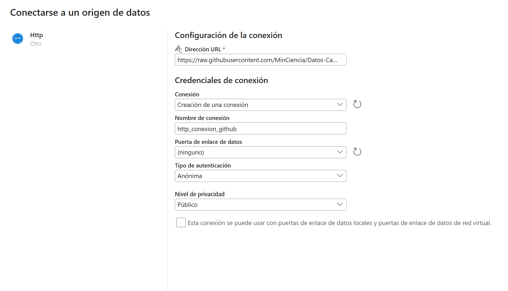

# 🚀 Pipeline Completo del Laboratorio

## 1️⃣ Crear conexión HTTP en Microsoft Fabric
*Esta conexión permite que el pipeline acceda a los archivos CSV alojados en el repositorio público de GitHub del Ministerio de Ciencia de Chile.*

### 📍 Pasos para crear la conexión
1. Entra a Data Factory dentro de Microsoft Fabric.
2. Ve a la sección Administrar conexiones (Manage connections).
3. Haz clic en Nueva conexión (New connection).
4. Selecciona el tipo de conexión HTTP.

5.Configura los siguientes parámetros:
Direccion url: https://raw.githubusercontent.com/MinCiencia/Datos-CambioClimatico
Nombre de la conexion: http_conexion_github
Tipo de autenticación: anónima.
Nivel de privacidad público

