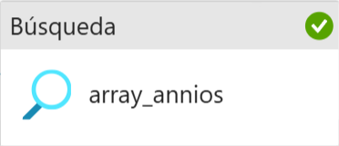

# 🌡️ Laboratorio de ingestión y transformación de datos meteorológicos con Microsoft Fabric

Este laboratorio muestra cómo automatizar de **forma totalmente orquestada** la carga, consolidación y transformación de archivos CSV de temperatura provenientes del repositorio GitHub del Ministerio de Ciencia de Chile, usando pipelines y notebooks en Microsoft Fabric.

---

## 🧩 Flujo general del pipeline (Fabric)

---

### 1️⃣ Actividad: Crear tabla de años (`nb_create_table_annios.ipynb`)
- **Tipo:** Notebook
- **Propósito:** Detecta los años disponibles en GitHub y actualiza la tabla Delta `tabla_annios` automáticamente.
- **Automatización total:** La tabla se crea si no existe y se actualiza con nuevos años sin intervención manual.
- 🔗 [Ver notebook nb_create_table_annios.ipynb](nb_create_table_annios.ipynb)
- 

---

### 2️⃣ Actividad Lookup — `array_annios`
- **Tipo:** Lookup
- **Propósito:** Lee la tabla de años y ejecuta la copia dinámica de los archivos CSV.
- **Items:**  
  `@activity('array_annios').output.value`
- 

---

### 3️⃣ 🔁 Copy Data — `copiar_ficheros_github`
- **Tipo:** Copy Data (interna en ForEach)
- **Propósito:** Copia cada CSV desde GitHub (`<año>/<año>_temperatura_dmc.csv`) a Files/Lakehouse.
- **Base URL:**  
  https://raw.githubusercontent.com/MinCiencia/Datos-CambioClimatico/refs/heads/main/output/temperatura_dmc/
- **Relative URL:**  
  `@concat(item().anio, '/', item().anio, '_temperatura_dmc.csv')`
- 

---

### 4️⃣ Bloc de notas — `nb_mover_scv`
- **Tipo:** Notebook
- **Propósito:** Mueve los archivos CSV descargados (por año) a la carpeta plana `temperatura_dmc_flat`.
- 🔗 [Ver notebook nb_mover_csv.ipynb](nb_mover_csv.ipynb)
- 

---

### 5️⃣ Bloc de notas — `nb_crear_tabla_temp_dmc`
- **Tipo:** Notebook
- **Propósito:** Lee los archivos planos, transforma y crea/enriquece la tabla Delta final `temperatura_dmc` (añadiendo columna `anio`).
- 🔗 [Ver notebook nb_crear_tabla_temperatura.ipynb](nb_crear_tabla_temperatura.ipynb)
- 

---

## 🏞️ Vista del Data Lakehouse tras ejecutar el pipeline

---

## 📦 Archivos incluidos

- `nb_create_table_annios.ipynb`
- `nb_mover_csv.ipynb`
- `nb_crear_tabla_temperatura.ipynb`
- `README.md`
- `/images/` (todas las capturas)

---

## 🚀 Autor

Desarrollado por [Oliver Pérez Jaén]  
Laboratorio de automatización de ingestión y transformación de datos meteorológicos usando Microsoft Fabric y GitHub.
