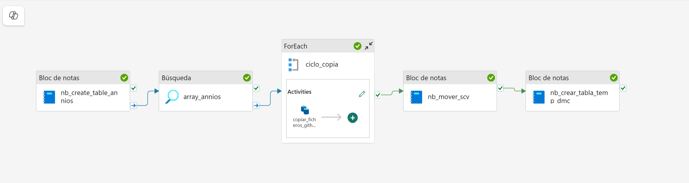

## 🔁 Laboratorio Fabric

Este pipeline optimiza la descarga y procesamiento de archivos CSV climáticos por año, desde el repositorio oficial del Ministerio de Ciencia de Chile.  
Aprovecha el poder de **Spark en Microsoft Fabric** para procesar de forma paralela los archivos.

---

### ⚙️ Estructura del pipeline optimizado

1. **📓 Notebook `nb_detectar_anios_pendientes`**  
   Detecta años disponibles en GitHub y los compara contra carpetas existentes en el Lakehouse. Devuelve un array con los años nuevos pendientes por copiar.

2. **🔁 Actividad `ForEach` (`ciclo_anios_a_copiar`)**  
   Ejecuta **en paralelo** la copia de archivos por cada año nuevo detectado. No espera a que termine una iteración para iniciar la siguiente.

   > 💡 Para que el `ForEach` reciba correctamente la salida del notebook como una colección iterable, es obligatorio:
   >
   > - Que el notebook devuelva un string JSON usando:
   >
   >   ```python
   >   import json
   >   from notebookutils import mssparkutils
   >   mssparkutils.notebook.exit(json.dumps([1950, 1951, 1952]))
   >   ```
   >
   > - Y que la expresión usada como `Items` en el `ForEach` sea:
   >
   >   ```text
   >   @json(activity('nb_detectar_anios_pendientes').output.result.exitValue)
   >   ```
   >
   > Si se omite `@json(...)` o se usa `return` en lugar de `exit()`, Fabric no podrá iterar sobre los valores, y se mostrará el error:
   > `"The function 'length' expects its parameter to be an array or a string"`

3. **📥 Actividad `Copy Data` (`copy_anio_csv`)**  
   Copia dinámicamente el archivo `año.csv` desde GitHub al directorio `Files/temperatura_dmc_raw/año/`.

4. **📓 Notebook `nb_crear_tabla_temp_dmc`**  
   Lee todos los archivos CSV desde `temperatura_dmc_flat`, extrae el año desde la columna `time`, y registra la tabla Delta `temperatura_dmc`.


## 🧪 Pipeline Completo del Laboratorio


