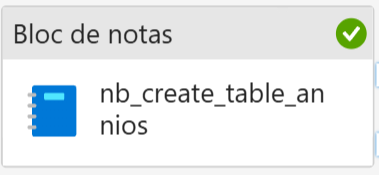
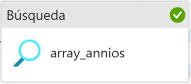

# 🌡️ Laboratorio de ingestión y transformación de datos meteorológicos con Microsoft Fabric

Este laboratorio muestra cómo automatizar **de forma totalmente orquestada** la carga, consolidación y transformación de archivos CSV de temperatura provenientes del repositorio GitHub del Ministerio de Ciencia de Chile, usando pipelines y notebooks en Microsoft Fabric.

---

## 🔗 **Flujo general del pipeline (Fabric)**

### 1️⃣ Actividad: Crear tabla de años (`nb_create_table_annios.ipynb`)



- **Descripción:** Notebook que detecta los años disponibles en GitHub y actualiza la tabla Delta `tabla_annios` automáticamente.
- **Automatización total:** La tabla se crea si no existe y se actualiza con nuevos años sin intervención manual.

---

### 2️⃣ Actividad: Lookup de años (`array_annios`)



- **Descripción:** Busca en la tabla `tabla_annios` para devolver la lista dinámica de años al pipeline.
- **Importante:** El resultado alimenta el ForEach para la iteración dinámica.

---

### 3️⃣ Actividad: ForEach (`ciclo_copia`)


- **Descripción:** Recorre todos los años detectados y ejecuta las actividades de copia para cada uno.
- **Items del ForEach:**  
  ```plaintext
  @activity('array_annios').output.value
  ```

---

### 4️⃣ Actividad: Copia dinámica desde GitHub (`copiar_ficheros_github`)


- **Descripción:** Descarga cada archivo CSV de GitHub usando conexión HTTP y parámetros dinámicos.
- **Configuración HTTP:**
  - **Base URL:**  
    ```
    https://raw.githubusercontent.com/MinCiencia/Datos-CambioClimatico/refs/heads/main/output/temperatura_dmc/
    ```
  - **Relative URL:**  
    ```
    @concat(item().anio, '/', item().anio, '_temperatura_dmc.csv')
    ```
- **Destino:** Carpeta en Files de Fabric, organizada por año o en carpeta plana posterior.

---

### 5️⃣ Actividad: Mover archivos a carpeta plana (`nb_mover_csv.ipynb`)


- **Descripción:** Notebook que mueve todos los `.csv` descargados de subcarpetas a una sola carpeta plana (`temperatura_dmc_flat`), facilitando la ingestión posterior.

---

### 6️⃣ Actividad: Crear y transformar tabla Delta (`nb_crear_tabla_temperatura.ipynb`)


- **Descripción:** Notebook Spark que:
  - Lee todos los archivos `.csv` desde la carpeta plana.
  - Guarda los datos en formato Delta.
  - Crea y registra automáticamente la tabla Delta externa `temperatura_dmc`.
  - Añade la columna `anio` extraída de la columna `time`, habilitando `mergeSchema` para evolución del esquema.
- **Automatización total:** La tabla se crea o actualiza **sin pasos manuales**, solo ejecutando el pipeline.

---

## ⚙️ **Parámetros y automatización**

- Todas las conexiones, rutas y nombres de archivos son **dinámicos** y se orquestan desde el pipeline.
- **No hay pasos manuales**: todo (carpetas, tablas, ingestion y transformación) se crea y actualiza automáticamente con los notebooks y actividades del pipeline.
- La tabla final es una **tabla Delta externa**, **no un shortcut ni vista**.

---

## 📂 **Archivos en este repositorio**

- `nb_create_table_annios.ipynb`: Notebook para detectar años y crear tabla Delta.
- `nb_mover_csv.ipynb`: Notebook para mover archivos a un directorio plano.
- `nb_crear_tabla_temperatura.ipynb`: Notebook para crear y enriquecer la tabla Delta.
- `README.md`: Esta documentación.
- `/images/`: Carpeta con capturas de pantalla de las actividades (puedes añadir más).

---

## 🚀 Autor

Desarrollado por [Tu Nombre o Usuario]  
Laboratorio de automatización de ingestión y transformación de datos meteorológicos usando Microsoft Fabric y GitHub.
